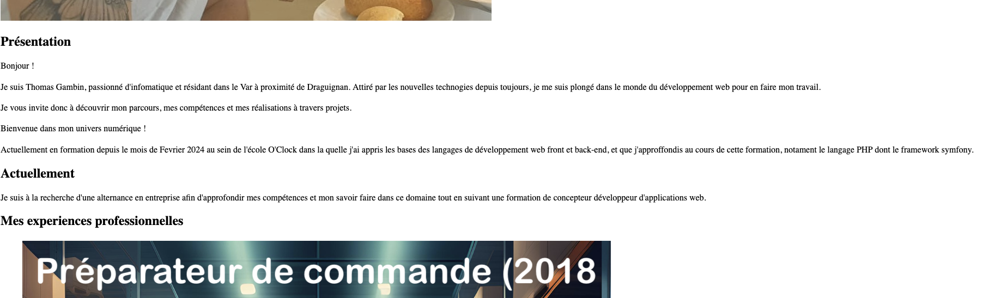
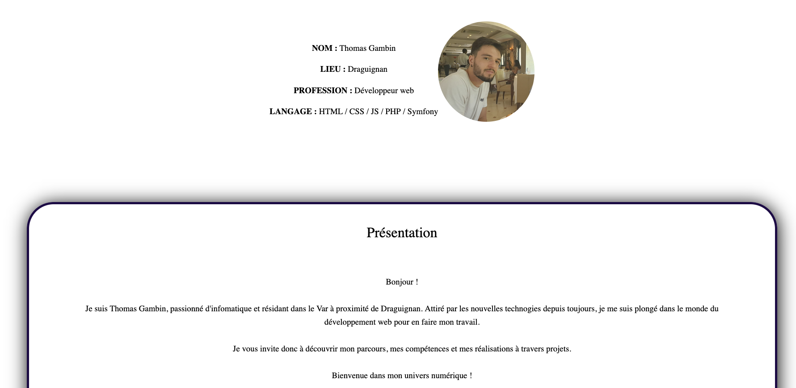
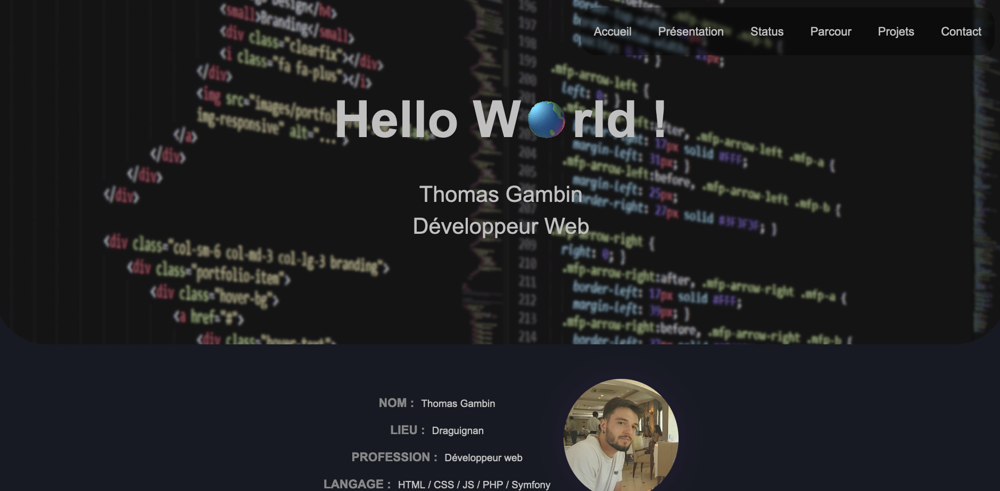

# Mon-portfolio

## Les différentes étapes :

* Étape 1
  * Création de la structure HTML
  * Mise en place des éléments (images/liens)
* Étape 2
  * Création CSS
  * Création JS
* Étape 3
  * Mise en place CSS final

## Étape 1

Pour cette étape, j'ai décidé de créer la structure de base à laquelle j'avais pensé

```html
<!doctype html>
<html lang="fr">

<head>
    <meta charset="UTF-8">
    <meta name="viewport" content="width=device-width, initial-scale=1.0">
    <title>Gambin Thomas</title>
</head>
<body>
    <header></header>
    <main>
        <section class="Accueil"></section>
        <section class="Presentation"></section>
        <section class="Satus-actuel"></section>
        <section class="Parcours"></section>
        <section class="Projet"></section>
        <section class="Contact"></section>
    </main>
</body>
```

Une fois la structure faite, j'y ai ajouté les différents textes, images et liens que j'avais.



## Étape 2

Pour cette deuxième étape, j'ai créé un CSS basique qui a permis de mettre en place la forme du site et de réajuster mon code en conséquence, pour que je puisse me repérer facilement.



Une fois le CSS créé j'ai ensuite codé la partie JavaScript pour avoir une barre de navigation clicable et un carrousel fonctionnel.

```javascript
function showSlides(n) {
    var i;
    var slides = document.getElementsByClassName("custom-slider");
    var dots = document.getElementsByClassName("dot");
    if (n > slides.length) { slideIndex = 1 }
    if (n < 1) { slideIndex = slides.length }
    for (i = 0; i < slides.length; i++) {
        slides[i].style.display = "none";
    }
    for (i = 0; i < dots.length; i++) {
        dots[i].className = dots[i].className.replace(" active", "");
    }
    slides[slideIndex - 1].style.display = "block";
    dots[slideIndex - 1].className += " active";
}
```

## Étape 3

Une fois les deux étapes précédentes faites et la fonctionnalité des actions vérifiée, j'ai donc terminé le CSS pour rendre le site responsive et obtenir le rendu final pour être pret à être déployer.




